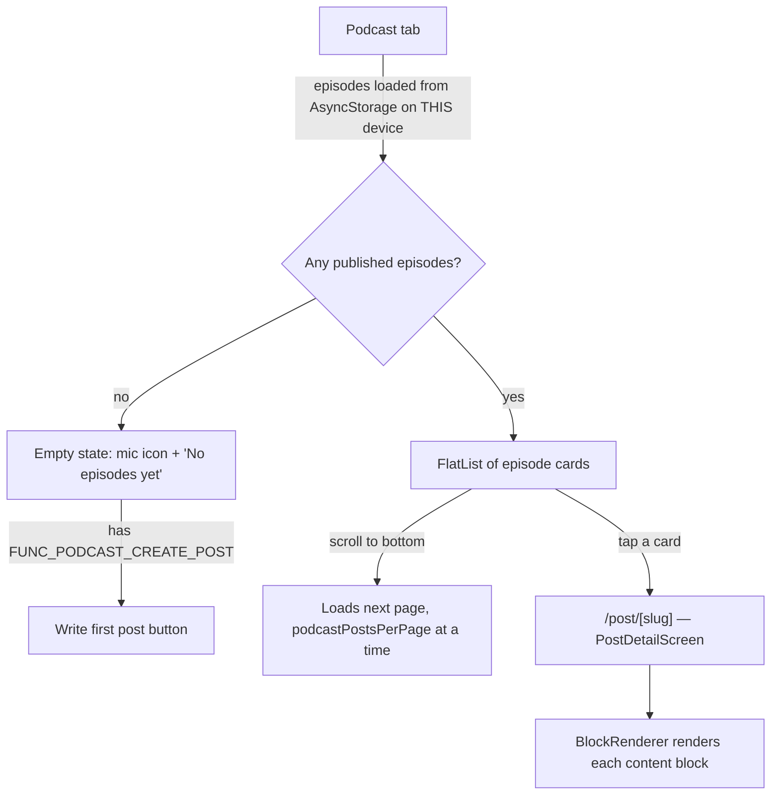
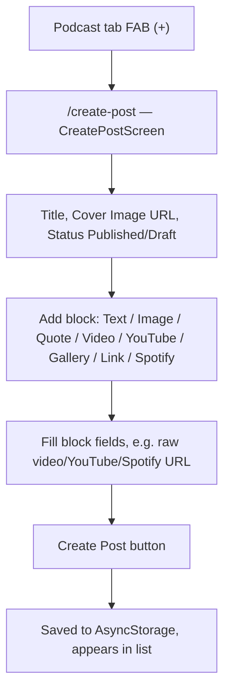
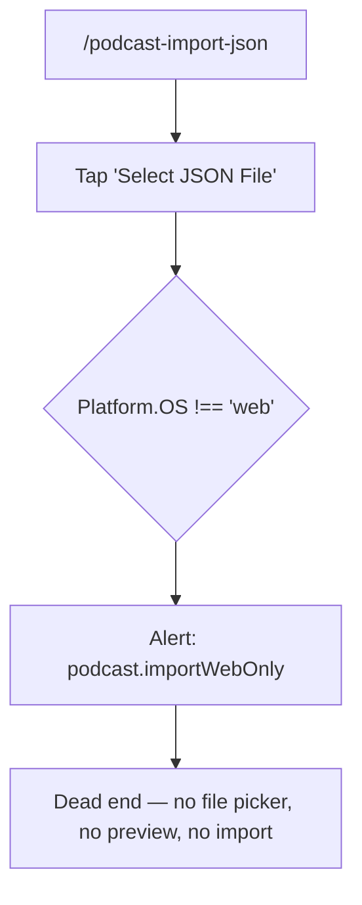

# Podcast Module — Mobile Flow

This document describes how the Podcast module behaves today on **iOS /
Android** (native — Expo Go or a built app), using the same journeys as
[`PODCAST_FLOW_WEB.md`](./PODCAST_FLOW_WEB.md) so the two can be read
side-by-side. Gaps between them are collected in
[`PODCAST_WEB_MOBILE_PARITY.md`](./PODCAST_WEB_MOBILE_PARITY.md).

Same screen inventory as the web doc — mobile and web run the exact same
screen files; the divergence is inside a handful of `Platform.OS` checks, not
a separate mobile implementation.

## 1. Browse → episode detail

Identical to web up to this point — including the same accent-tinted
placeholder cover when there's no `coverUrl`. Note the "on THIS device"
caveat on step 1: because posts live in local `AsyncStorage` with no backend
sync, an episode created on web (or on a different phone) will never appear
here — this is the storage-sync issue discussed separately, not a rendering
gap, and not something either flow doc can fix.

## 2. Content block rendering (the part that matters for parity)

Same `BlockRenderer.tsx`, same switch statement — but the non-`web` branch:

| Block type | Mobile rendering |
| --- | --- |
| `text` | Plain text (HTML tags stripped) — identical to web |
| `image` | `<Image>` — identical to web |
| `video` | Static placeholder: video icon + `Video: <raw url>` text. **Not tappable, does not play.** |
| `embed` (YouTube/Vimeo) | Static placeholder: video icon + `YouTube: <id>` or `Vimeo: <id>` text. **Not tappable, does not play.** |
| `spotify` | Tappable card ("`<Type>` on Spotify") that calls `Linking.openURL` — opens the Spotify app or browser. **Degraded but functional.** |
| `quote` | Identical to web |
| `gallery` | Identical to web |
| `link` | Identical to web |

This is the core parity gap: a listener who taps into an episode with a video
or YouTube/Vimeo block sees inert text with a raw URL in it — no player, no
tap-to-open, nothing actionable. Spotify blocks are the one media type that at
least degrades gracefully.

## 3. Create / edit an episode

Identical to web — every block type can be added, with the same fields. A
mobile user composing a video block has no indication at creation time that
it won't be playable later (on their device or anyone else's) — the
degradation only shows up when *viewing* the post.

## 4. Podcast settings

Identical to web. `PodcastConfigScreen.tsx` has no `Platform.OS` branches.

## 5. JSON import

The entire feature is gated off before it does anything. `handleSelectFile`
(`PodcastImportScreen.tsx:22-27`) shows an alert and returns; the
`<input type="file">` element itself is wrapped in
`{Platform.OS === 'web' && (...)}` so it never even mounts on mobile. There is
currently no native equivalent (e.g. a document/file picker) — a mobile admin
who wants to bulk-import episodes has no path to do so on their device at all.
