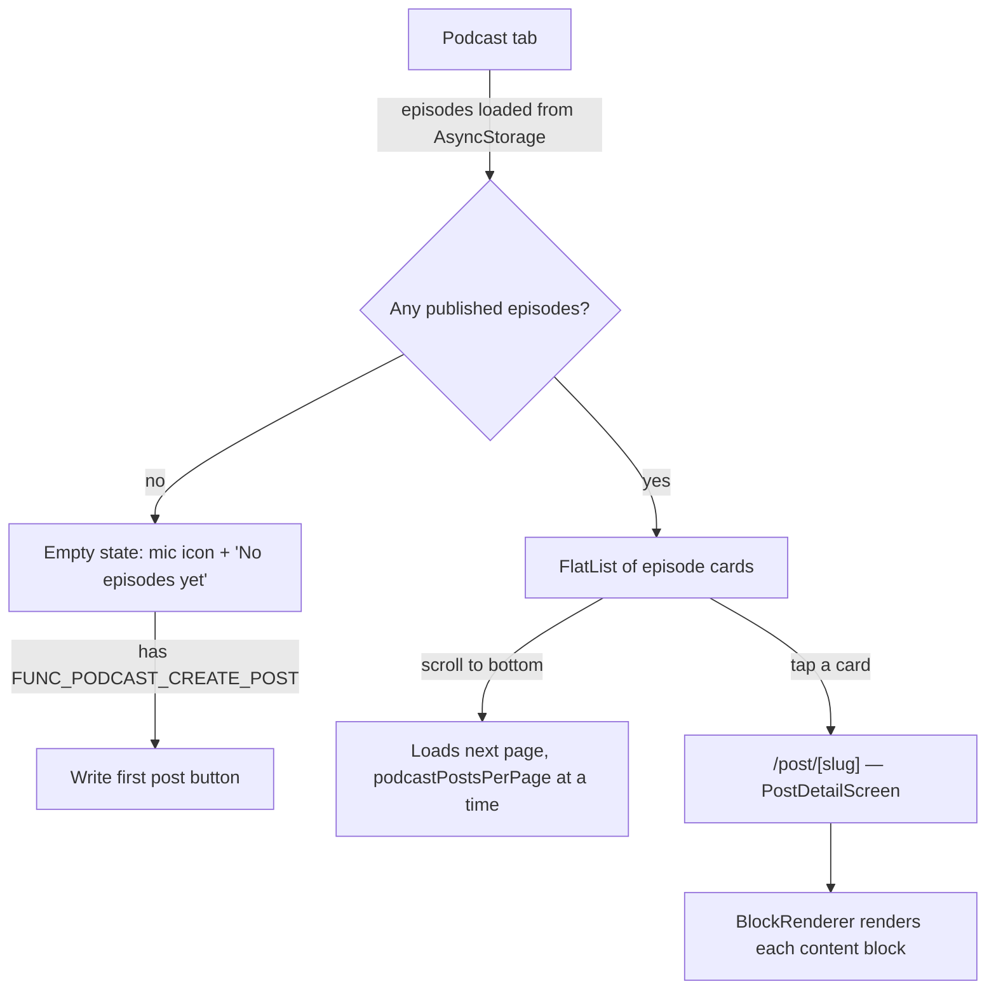
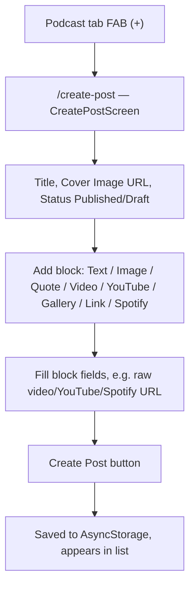

# Podcast Module — Web Flow

This document describes how the Podcast module (`expo/modules/podcast/`,
plus the shared post screens it reuses) behaves today when the app runs on
**web** (`expo start --web` / the deployed web build). It is the web half of
a pair with [`PODCAST_FLOW_MOBILE.md`](./PODCAST_FLOW_MOBILE.md); the gaps
between the two are collected in
[`PODCAST_WEB_MOBILE_PARITY.md`](./PODCAST_WEB_MOBILE_PARITY.md).

Podcast episodes are not a separate data type — they are `Post` records
(`shared/types/posts.ts`) filtered/paginated by the Podcast tab. There is no
dedicated "create episode" screen; the Podcast tab's create button opens the
same `CreatePostScreen` used by the Feed tab.

## Screen inventory

| Screen | File | Route |
| --- | --- | --- |
| Podcast list | `modules/podcast/screens/PodcastScreen.tsx` | `/(tabs)/podcast` |
| Episode detail | `modules/feed/screens/PostDetailScreen.tsx` (shared) | `/post/[slug]` |
| Create episode | `modules/feed/screens/CreatePostScreen.tsx` (shared) | `/create-post` |
| Edit episode | `modules/feed/screens/EditPostScreen.tsx` (shared) | `/edit-post/[id]` |
| Podcast settings | `modules/podcast/screens/PodcastConfigScreen.tsx` | `/podcast-config` |
| JSON import | `modules/podcast/screens/PodcastImportScreen.tsx` | `/podcast-import-json` |

## 1. Browse → episode detail

Card appearance (`PodcastScreen.tsx`): if the post has a `coverUrl`, it renders
as a real `<Image>`; if not, it shows a colored placeholder tinted with the
Podcast section's own accent color (`colors.accentPodcast`) with a mic icon —
this is one of the few places Podcast is visually distinct from Feed.

## 2. Content block rendering (the part that matters for parity)

`BlockRenderer.tsx` renders each block type. On web:

| Block type | Web rendering |
| --- | --- |
| `text` | Plain text (HTML tags stripped) |
| `image` | `<Image>` |
| `video` | Real HTML `<video src=... controls>` — plays inline |
| `embed` (YouTube/Vimeo) | Live `<iframe>` embed, full playback |
| `spotify` | Live Spotify `<iframe>` embed (track/album/playlist/episode/show player) |
| `quote` | Styled quote block |
| `gallery` | Grid of images |
| `link` | Tappable card, opens URL |

All six non-media block types are identical to mobile. The three media types
(`video`, `embed`, `spotify`) are where web is materially richer — see the
parity doc.

## 3. Create / edit an episode

The compose screen itself has **no web-only behavior** — every block type is
addable on any platform (`BLOCK_TYPES` in `CreatePostScreen.tsx` is not
filtered by `Platform.OS`). A web user can add a video block and immediately
see it play back correctly, because playback (not creation) is where the web
implementation is more capable.

## 4. Podcast settings

`PodcastConfigScreen.tsx` — episodes-per-page counter (5–50, step 5) and, if
the user has `FUNC_PODCAST_IMPORT_JSON`, a row linking to JSON import. No
`Platform.OS` branching here; identical on both platforms.

## 5. JSON import

```mermaid
flowchart TD
    A["/podcast-import-json"] --> B["Tap 'Select JSON File'"]
    B --> C["Hidden native <input type=file accept=.json> is .click()'ed"]
    C --> D[Browser file picker opens]
    D --> E[FileReader reads file as text]
    E --> F[parsePodcastJson parses it]
    F --> G[Preview: first 3 episodes + count]
    G --> H["Tap 'Import N Posts'"]
    H --> I[convertEpisodesToPosts + importPosts]
    I --> J[Saved to AsyncStorage, success/partial-failure alert]
```

This entire flow only exists because `Platform.OS === 'web'` — see the parity
doc for what happens instead on mobile.
