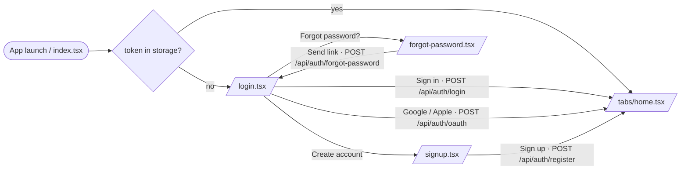
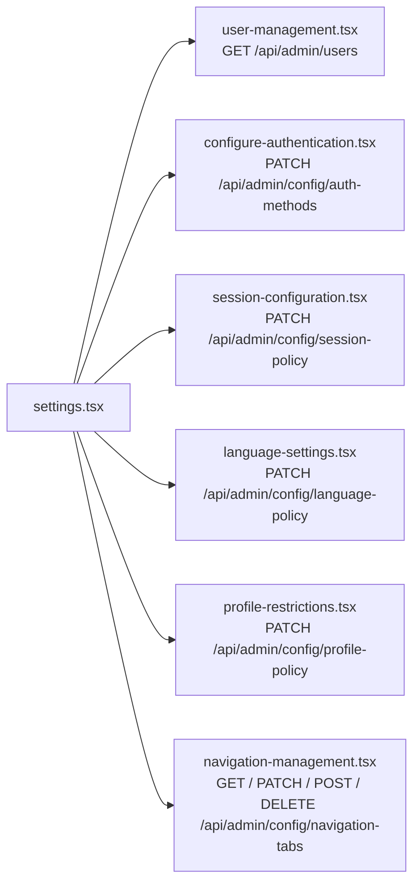

# Screen Flows, Navigation & Use Cases

This document describes every screen of the `rork-standard-app` Expo client, how
the user navigates between them, and which `standard-base` HTTP endpoints each
screen calls. It is the single reference for designers, QA, and developers
working on the mobile shell.

## 1. Tech Stack

| Item | Value |
| --- | --- |
| Framework | React Native + Expo 54 |
| Routing | `expo-router` (file-based, in `expo/app/`) |
| Language | TypeScript (strict) |
| State | React Context (`AuthContext`, `AdminConfigContext`, `PreferencesContext`, `UserManagementContext`) + `AsyncStorage` |
| Backend | `standard-base` (Spring Boot, OpenAPI at `src/main/resources/openapi/api.yml`) |
| HTTP layer | `expo/services/*.ts` (`auth.ts`, `api.ts`, `userProfile.ts`, `adminConfig.ts`, `adminUsers.ts`) |

Test credentials (mock auth seed): `user@example.com / password123` (standard) and `admin@example.com / admin123` (admin).

---

## 2. Screen Inventory

| Route | File | Auth | Role | Purpose |
| --- | --- | --- | --- | --- |
| `/` | `expo/app/index.tsx` | none | any | Entry point; redirects to `/login` or `/(tabs)/home`. |
| `/login` | `expo/app/login.tsx` | none | any | Email/password + Google + Apple sign-in. |
| `/signup` | `expo/app/signup.tsx` | none | any | Account creation. |
| `/forgot-password` | `expo/app/forgot-password.tsx` | none | any | Request a password-reset email. |
| `/(tabs)/home` | `expo/app/(tabs)/home.tsx` | yes | any | Primary dashboard. |
| `/(tabs)/feed` | `expo/app/(tabs)/feed.tsx` | yes | any | News / activity feed. |
| `/(tabs)/podcast` | `expo/app/(tabs)/podcast.tsx` | yes | any | Podcast content. |
| `/(tabs)/skate-square` | `expo/app/(tabs)/skate-square.tsx` | yes | any | Community / social feed. |
| `/(tabs)/settings` | `expo/app/(tabs)/settings.tsx` | yes | any | Profile + preferences; admin entry-point. |
| `/admin-config` | `expo/app/admin-config.tsx` | yes | admin | Admin landing page. |
| `/user-management` | `expo/app/user-management.tsx` | yes | admin | List / disable / delete users. |
| `/configure-authentication` | `expo/app/configure-authentication.tsx` | yes | admin | Toggle auth methods (Google / Apple / manual). |
| `/session-configuration` | `expo/app/session-configuration.tsx` | yes | admin | Session max + idle + auto-refresh. |
| `/language-settings` | `expo/app/language-settings.tsx` | yes | admin | Available languages and default. |
| `/profile-restrictions` | `expo/app/profile-restrictions.tsx` | yes | admin | Username length + avatar policy. |
| `/navigation-management` | `expo/app/navigation-management.tsx` | yes | admin | Reorder / toggle / add / remove tabs. |
| `/modal` | `expo/app/modal.tsx` | yes | any | Generic dialog overlay. |

Auth gating lives in `expo/app/_layout.tsx` (protected route list) and
`(tabs)/_layout.tsx` (dynamic tab rendering driven by `AdminConfigContext`).

---

## 3. Per-Screen Buttons, Routes & Endpoints

Each row reads: **button / action &rarr; route navigated to &rarr; backend
endpoint(s) invoked &rarr; linked use case**.

| Screen | Action | Target route | Endpoint(s) | UC |
| --- | --- | --- | --- | --- |
| `login.tsx` | Sign in | `/(tabs)/home` | `POST /api/auth/login` &rarr; `GET /api/auth/me` | [UC1](#uc1) |
| `login.tsx` | Continue with Google | `/(tabs)/home` | `POST /api/auth/oauth` &rarr; `GET /api/auth/me` | [UC1](#uc1) |
| `login.tsx` | Continue with Apple | `/(tabs)/home` | `POST /api/auth/oauth` &rarr; `GET /api/auth/me` | [UC1](#uc1) |
| `login.tsx` | Forgot password? | `/forgot-password` | _(none)_ | [UC3](#uc3) |
| `login.tsx` | Create account | `/signup` | _(none)_ | [UC2](#uc2) |
| `signup.tsx` | Sign up | `/(tabs)/home` | `POST /api/auth/register` &rarr; `GET /api/auth/me` | [UC2](#uc2) |
| `signup.tsx` | Continue with Google / Apple | `/(tabs)/home` | `POST /api/auth/oauth` | [UC2](#uc2) |
| `forgot-password.tsx` | Send reset link | `/login` | `POST /api/auth/forgot-password` | [UC3](#uc3) |
| `(tabs)/home.tsx` | _(content)_ | _(stays)_ | _(mocked)_ | [UC1](#uc1) |
| `(tabs)/feed.tsx` | _(content)_ | _(stays)_ | _(mocked)_ | [UC1](#uc1) |
| `(tabs)/podcast.tsx` | _(content)_ | _(stays)_ | _(mocked)_ | [UC1](#uc1) |
| `(tabs)/skate-square.tsx` | _(content)_ | _(stays)_ | _(mocked)_ | [UC1](#uc1) |
| `(tabs)/settings.tsx` | Save profile / avatar | _(stays)_ | `PATCH /api/users/me/profile` | [UC4](#uc4) |
| `(tabs)/settings.tsx` | Load preferences | _(stays)_ | `GET /api/users/me/preferences` | [UC4](#uc4) |
| `(tabs)/settings.tsx` | Theme / language toggle | _(stays)_ | `PATCH /api/users/me/preferences` | [UC4](#uc4) |
| `(tabs)/settings.tsx` | Logout | `/login` | _(none, clears token)_ | [UC4](#uc4) |
| `(tabs)/settings.tsx` | User Management (admin) | `/user-management` | _(none)_ | [UC5](#uc5) |
| `(tabs)/settings.tsx` | Configure Authentication (admin) | `/configure-authentication` | _(none)_ | [UC7](#uc7) |
| `(tabs)/settings.tsx` | Session Configuration (admin) | `/session-configuration` | _(none)_ | [UC8](#uc8) |
| `(tabs)/settings.tsx` | Language Settings (admin) | `/language-settings` | _(none)_ | [UC9](#uc9) |
| `(tabs)/settings.tsx` | Profile Restrictions (admin) | `/profile-restrictions` | _(none)_ | [UC10](#uc10) |
| `(tabs)/settings.tsx` | Navigation Management (admin) | `/navigation-management` | _(none)_ | [UC6](#uc6) |
| `user-management.tsx` | Load list | _(stays)_ | `GET /api/admin/users` | [UC5](#uc5) |
| `user-management.tsx` | Toggle role / status | _(stays)_ | `PATCH /api/admin/users/{userId}` | [UC5](#uc5) |
| `user-management.tsx` | Delete user | _(stays)_ | `DELETE /api/admin/users/{userId}` | [UC5](#uc5) |
| `configure-authentication.tsx` | Toggle Google/Apple/Email | _(stays)_ | `PATCH /api/admin/config/auth-methods` | [UC7](#uc7) |
| `session-configuration.tsx` | Save sliders | _(stays)_ | `PATCH /api/admin/config/session-policy` | [UC8](#uc8) |
| `language-settings.tsx` | Save selection | _(stays)_ | `PATCH /api/admin/config/language-policy` | [UC9](#uc9) |
| `profile-restrictions.tsx` | Save policy | _(stays)_ | `PATCH /api/admin/config/profile-policy` | [UC10](#uc10) |
| `navigation-management.tsx` | Load tabs | _(stays)_ | `GET /api/admin/config` | [UC6](#uc6) |
| `navigation-management.tsx` | Reorder / toggle | _(stays)_ | `PATCH /api/admin/config/navigation-tabs` | [UC6](#uc6) |
| `navigation-management.tsx` | Add custom tab | _(stays)_ | `POST /api/admin/config/navigation-tabs` | [UC6](#uc6) |
| `navigation-management.tsx` | Remove tab | _(stays)_ | `DELETE /api/admin/config/navigation-tabs/{tabId}` | [UC6](#uc6) |

---

## 4. Endpoint Reference

Endpoints below come from `standard-base` &rarr; `src/main/resources/openapi/api.yml`. Each row links to the use case(s) that exercise it.

### Auth

| Method + path | Used by |
| --- | --- |
| `POST /api/auth/register` | [UC2](#uc2) |
| `POST /api/auth/login` | [UC1](#uc1) |
| `POST /api/auth/oauth` | [UC1](#uc1), [UC2](#uc2) |
| `GET  /api/auth/me` | [UC1](#uc1), [UC2](#uc2) |
| `POST /api/auth/refresh` | [UC4](#uc4) |
| `POST /api/auth/forgot-password` | [UC3](#uc3) |
| `POST /api/auth/reset-password` | [UC3](#uc3) |

### User self-service

| Method + path | Used by |
| --- | --- |
| `PATCH /api/users/me/profile` | [UC4](#uc4) |
| `GET   /api/users/me/preferences` | [UC4](#uc4) |
| `PATCH /api/users/me/preferences` | [UC4](#uc4) |

### Admin &mdash; users

| Method + path | Used by |
| --- | --- |
| `GET    /api/admin/users` | [UC5](#uc5) |
| `PATCH  /api/admin/users/{userId}` | [UC5](#uc5) |
| `DELETE /api/admin/users/{userId}` | [UC5](#uc5) |

### Admin &mdash; configuration

| Method + path | Used by |
| --- | --- |
| `GET    /api/admin/config` | [UC6](#uc6) |
| `PATCH  /api/admin/config/auth-methods` | [UC7](#uc7) |
| `PATCH  /api/admin/config/session-policy` | [UC8](#uc8) |
| `PATCH  /api/admin/config/language-policy` | [UC9](#uc9) |
| `PATCH  /api/admin/config/profile-policy` | [UC10](#uc10) |
| `PATCH  /api/admin/config/regional` | [UC4](#uc4) |
| `PATCH  /api/admin/config/navigation-tabs` | [UC6](#uc6) |
| `POST   /api/admin/config/navigation-tabs` | [UC6](#uc6) |
| `DELETE /api/admin/config/navigation-tabs/{tabId}` | [UC6](#uc6) |

---

## 5. Navigation Diagrams

### 5.1 Auth flow



### 5.2 Tab navigation

```mermaid
flowchart LR
    TabBar([Tab bar &middot; (tabs)/_layout.tsx]) --> Home[home.tsx]
    TabBar --> Feed[feed.tsx]
    TabBar --> Podcast[podcast.tsx]
    TabBar --> Skate[skate-square.tsx]
    TabBar --> Settings[settings.tsx]
    Note["Tabs are rendered dynamically from<br/>config.navigationConfig.tabs<br/>(visibility &amp; order driven by AdminConfigContext)"]
    TabBar -.- Note
```

### 5.3 Admin sub-tree (entered from the Settings tab)



### 5.4 Use-Case &harr; Screen &harr; Endpoint map

This is the diagram that ties everything together. Read left-to-right: a use
case fans out to the screens it walks through, which in turn fan out to the
endpoints they call. Read right-to-left to find every use case that depends on
a given endpoint.

```mermaid
flowchart LR
    %% --- Use cases ---
    subgraph UCs["Use Cases"]
        direction TB
        UC1((UC1<br/>Login &amp; browse))
        UC2((UC2<br/>Sign up))
        UC3((UC3<br/>Password recovery))
        UC4((UC4<br/>Profile / preferences / logout))
        UC5((UC5<br/>Admin disables / deletes user))
        UC6((UC6<br/>Admin manages tabs))
        UC7((UC7<br/>Admin toggles auth providers))
        UC8((UC8<br/>Admin tunes session))
        UC9((UC9<br/>Admin manages languages))
        UC10((UC10<br/>Admin sets profile policy))
    end

    %% --- Screens ---
    subgraph Screens["Screens"]
        direction TB
        SLogin[login.tsx]
        SSignup[signup.tsx]
        SForgot[forgot-password.tsx]
        STabs[(tabs) home / feed / podcast / skate-square]
        SSettings[(tabs)/settings.tsx]
        SUserMgmt[user-management.tsx]
        SAuthCfg[configure-authentication.tsx]
        SSession[session-configuration.tsx]
        SLang[language-settings.tsx]
        SProfile[profile-restrictions.tsx]
        SNav[navigation-management.tsx]
    end

    %% --- Endpoints ---
    subgraph Endpoints["Backend endpoints"]
        direction TB
        EAuthLogin["POST /api/auth/login"]:::auth
        EAuthOAuth["POST /api/auth/oauth"]:::auth
        EAuthMe["GET /api/auth/me"]:::auth
        EAuthRegister["POST /api/auth/register"]:::auth
        EAuthForgot["POST /api/auth/forgot-password"]:::auth
        EAuthReset["POST /api/auth/reset-password"]:::auth
        EAuthRefresh["POST /api/auth/refresh"]:::auth
        EUserProfile["PATCH /api/users/me/profile"]:::user
        EUserPrefsGet["GET /api/users/me/preferences"]:::user
        EUserPrefsPatch["PATCH /api/users/me/preferences"]:::user
        EAdmUsers["GET /api/admin/users"]:::adminU
        EAdmUserPatch["PATCH /api/admin/users/{id}"]:::adminU
        EAdmUserDel["DELETE /api/admin/users/{id}"]:::adminU
        EAdmCfgGet["GET /api/admin/config"]:::adminC
        EAdmAuth["PATCH /api/admin/config/auth-methods"]:::adminC
        EAdmSession["PATCH /api/admin/config/session-policy"]:::adminC
        EAdmLang["PATCH /api/admin/config/language-policy"]:::adminC
        EAdmProf["PATCH /api/admin/config/profile-policy"]:::adminC
        EAdmTabsPatch["PATCH /api/admin/config/navigation-tabs"]:::adminC
        EAdmTabsPost["POST /api/admin/config/navigation-tabs"]:::adminC
        EAdmTabsDel["DELETE /api/admin/config/navigation-tabs/{tabId}"]:::adminC
        Mocked(["(mocked, no call)"]):::mock
    end

    %% --- UC -> Screen edges ---
    UC1 --> SLogin
    UC1 --> STabs
    UC2 --> SSignup
    UC2 --> SLogin
    UC3 --> SForgot
    UC3 --> SLogin
    UC4 --> SSettings
    UC5 --> SUserMgmt
    UC5 --> SSettings
    UC6 --> SNav
    UC6 --> SSettings
    UC7 --> SAuthCfg
    UC7 --> SSettings
    UC8 --> SSession
    UC8 --> SSettings
    UC9 --> SLang
    UC9 --> SSettings
    UC10 --> SProfile
    UC10 --> SSettings

    %% --- Screen -> Endpoint edges ---
    SLogin --> EAuthLogin
    SLogin --> EAuthOAuth
    SLogin --> EAuthMe
    SSignup --> EAuthRegister
    SSignup --> EAuthOAuth
    SSignup --> EAuthMe
    SForgot --> EAuthForgot
    STabs --> Mocked
    SSettings --> EUserProfile
    SSettings --> EUserPrefsGet
    SSettings --> EUserPrefsPatch
    SSettings --> EAuthRefresh
    SUserMgmt --> EAdmUsers
    SUserMgmt --> EAdmUserPatch
    SUserMgmt --> EAdmUserDel
    SAuthCfg --> EAdmAuth
    SSession --> EAdmSession
    SLang --> EAdmLang
    SProfile --> EAdmProf
    SNav --> EAdmCfgGet
    SNav --> EAdmTabsPatch
    SNav --> EAdmTabsPost
    SNav --> EAdmTabsDel

    classDef auth fill:#e3f2fd,stroke:#1565c0,color:#0d47a1;
    classDef user fill:#e8f5e9,stroke:#2e7d32,color:#1b5e20;
    classDef adminU fill:#fff3e0,stroke:#ef6c00,color:#e65100;
    classDef adminC fill:#fce4ec,stroke:#c2185b,color:#880e4f;
    classDef mock fill:#eeeeee,stroke:#9e9e9e,color:#424242,stroke-dasharray: 4 2;
```

---

## 6. Use Cases

Each use case lists the actor, preconditions, and the screen-by-screen
journey with the endpoints invoked at every step.

<a id="uc1"></a>
### UC1 &mdash; Standard login &amp; browse tabs

- **Actor**: registered standard user.
- **Pre**: account exists, auth method enabled.
- **Steps**:
  1. `index.tsx` finds no token &rarr; routes to `login.tsx`.
  2. User submits credentials &rarr; `POST /api/auth/login`.
  3. Token stored, `GET /api/auth/me` populates `AuthContext`.
  4. `router.replace('/(tabs)/home')`; tab bar rendered from `AdminConfigContext`.
  5. User taps Feed / Podcast / Skate Square (mocked content, no call).

<a id="uc2"></a>
### UC2 &mdash; Sign up

- **Actor**: anonymous visitor.
- **Pre**: manual signup enabled in `AppConfig`.
- **Steps**:
  1. From `login.tsx` &rarr; "Create account" &rarr; `signup.tsx`.
  2. Submit form &rarr; `POST /api/auth/register` (or `POST /api/auth/oauth` if Google/Apple).
  3. `GET /api/auth/me` &rarr; `router.replace('/(tabs)/home')`.

<a id="uc3"></a>
### UC3 &mdash; Password recovery

- **Actor**: registered user who forgot their password.
- **Steps**:
  1. From `login.tsx` &rarr; "Forgot password?" &rarr; `forgot-password.tsx`.
  2. Submit email &rarr; `POST /api/auth/forgot-password`.
  3. User receives email link, opens deep-link &rarr; `POST /api/auth/reset-password` (server-side flow).
  4. Returns to `login.tsx`.

<a id="uc4"></a>
### UC4 &mdash; Profile / preferences update + logout

- **Actor**: any authenticated user.
- **Steps**:
  1. Tab bar &rarr; `(tabs)/settings.tsx`.
  2. Update display name / avatar &rarr; `PATCH /api/users/me/profile`.
  3. Toggle theme / language &rarr; `GET /api/users/me/preferences`, then `PATCH /api/users/me/preferences`.
  4. On idle / max-session timeout, client calls `POST /api/auth/refresh`; on failure, clears token and redirects to `login.tsx`.
  5. "Logout" &rarr; clear token &rarr; `router.replace('/login')`.

<a id="uc5"></a>
### UC5 &mdash; Admin disables / deletes user

- **Actor**: admin.
- **Steps**:
  1. `(tabs)/settings.tsx` &rarr; "User Management" &rarr; `user-management.tsx`.
  2. List loads &rarr; `GET /api/admin/users` (with role/status/search filters).
  3. Toggle a user's role or status &rarr; `PATCH /api/admin/users/{userId}`.
  4. Delete &rarr; `DELETE /api/admin/users/{userId}`.

<a id="uc6"></a>
### UC6 &mdash; Admin manages navigation tabs

- **Actor**: admin.
- **Steps**:
  1. `(tabs)/settings.tsx` &rarr; "Navigation Management" &rarr; `navigation-management.tsx`.
  2. Load current tabs &rarr; `GET /api/admin/config`.
  3. Drag-reorder or toggle visibility &rarr; `PATCH /api/admin/config/navigation-tabs`.
  4. Add custom tab &rarr; `POST /api/admin/config/navigation-tabs`.
  5. Remove tab &rarr; `DELETE /api/admin/config/navigation-tabs/{tabId}`.
  6. `AdminConfigContext` re-renders the live tab bar.

<a id="uc7"></a>
### UC7 &mdash; Admin toggles auth providers

- **Actor**: admin.
- **Steps**:
  1. `(tabs)/settings.tsx` &rarr; "Configure Authentication" &rarr; `configure-authentication.tsx`.
  2. Toggle Google / Apple / Email &rarr; `PATCH /api/admin/config/auth-methods`.
  3. Login screen reflects the new options on next launch.

<a id="uc8"></a>
### UC8 &mdash; Admin tunes session timeouts

- **Actor**: admin.
- **Steps**:
  1. `(tabs)/settings.tsx` &rarr; "Session Configuration" &rarr; `session-configuration.tsx`.
  2. Adjust max-session, idle, auto-refresh &rarr; `PATCH /api/admin/config/session-policy`.

<a id="uc9"></a>
### UC9 &mdash; Admin manages languages

- **Actor**: admin.
- **Steps**:
  1. `(tabs)/settings.tsx` &rarr; "Language Settings" &rarr; `language-settings.tsx`.
  2. Pick available languages and default &rarr; `PATCH /api/admin/config/language-policy`.
  3. Optionally update timezone / date format &rarr; `PATCH /api/admin/config/regional`.

<a id="uc10"></a>
### UC10 &mdash; Admin sets profile restrictions

- **Actor**: admin.
- **Steps**:
  1. `(tabs)/settings.tsx` &rarr; "Profile Restrictions" &rarr; `profile-restrictions.tsx`.
  2. Edit username length bounds and avatar policy &rarr; `PATCH /api/admin/config/profile-policy`.

---

## 7. Maintaining This Document

- When a screen is added: append a row to sections **2** and **3**, add the
  node to diagram **5.4**, and link it from the relevant use case in **6**.
- When an endpoint is added: add it to **4**, add the node + edge in **5.4**,
  and reference it from the consuming screen and use case.
- Keep endpoint paths in sync with `standard-base` &rarr; `src/main/resources/openapi/api.yml`.
